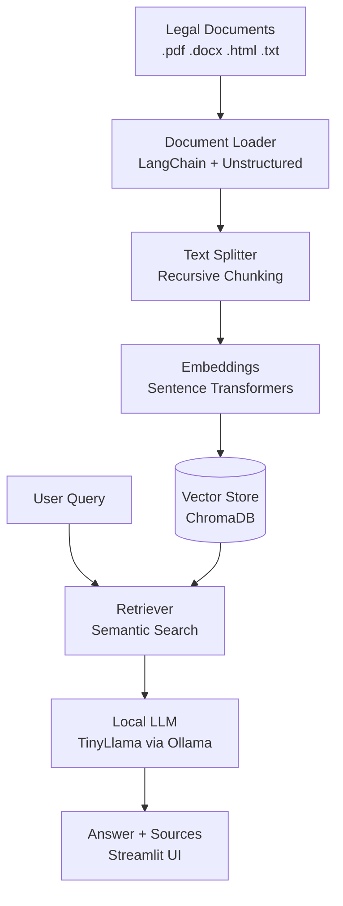

# ⚖️ Legal Chatbot — Local RAG Pipeline for Indian Law

A privacy-first legal Q&A system that runs entirely on your laptop.
No API keys. No data leaves your machine.


---

## 🧠 Architecture



---

## ✨ Features

- 🔒 **Fully local** — LLM runs on your machine via Ollama
- 📄 **Multi-format** — reads PDF, DOCX, HTML, TXT
- 🔍 **Source citations** — every answer shows which law it came from
- ⚡ **Smart re-indexing** — only reprocesses changed files
- 🇮🇳 **Indian law focus** — prompt-tuned for Indian legal context

---

## 🚀 Quickstart

```bash
# 1. Install dependencies
pip install langchain chromadb streamlit sentence-transformers pymupdf python-docx unstructured[docx]

# 2. Install Ollama and pull model
# Download from https://ollama.com
ollama run tinyllama

# 3. Add your legal documents to data/
# Examples: hindu_succession_act.pdf, model_tenancy_act.txt

# 4. Run
streamlit run app.py
```

Visit `localhost:8501` and start asking questions.

---

## 💬 Example Queries

- *"What happens if someone dies without a will?"*
- *"Can a tenant be evicted without notice?"*
- *"What rights do senior citizens have under Indian law?"*

---

## 🛠️ Tech Stack

| Component | Tool |
|---|---|
| LLM | TinyLlama / Llama2 / Mistral via Ollama |
| Orchestration | LangChain |
| Vector DB | ChromaDB |
| Embeddings | Sentence Transformers |
| UI | Streamlit |
| Doc parsing | PyMuPDF, python-docx, Unstructured |

---

## 🎯 Use Cases

Perfect for law students, civic tech activists, and anyone
building tools for access to justice in India.

---

## 📄 Legal Document Sources

- [India Code](https://www.indiacode.nic.in)
- [eGazette](https://egazette.nic.in)
- State-specific rent acts and succession rules

---

## 🔭 Roadmap

- [ ] Add Hindi language support
- [ ] Swap ChromaDB for Milvus for larger corpora
- [ ] Add LLM-as-judge evaluation layer
- [ ] Support for court judgments (eCourts API)

---

## 👤 Author

**Joy Bose** — Senior Data Scientist & AI Architect  
[LinkedIn](https://linkedin.com/in/joyboseroy) · 
[Medium](https://medium.com/@joyboseroy) · 
[Google Scholar](https://scholar.google.com/citations?user=1E0YgA4AAAAJ)
